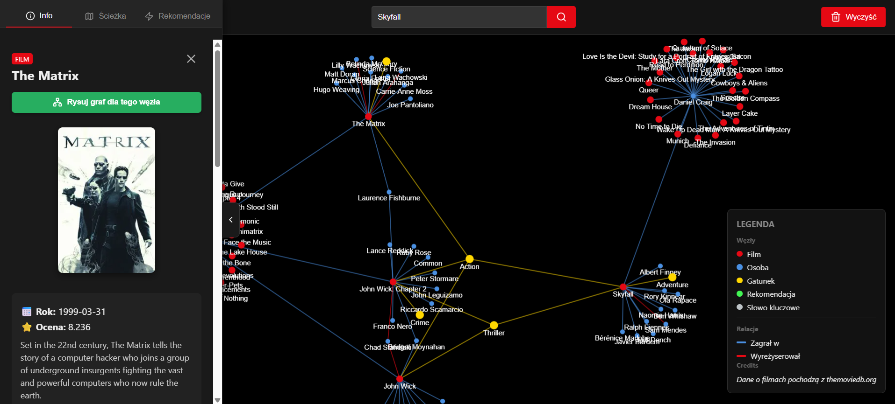
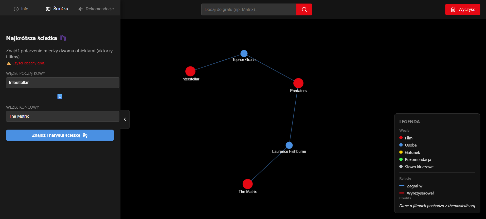
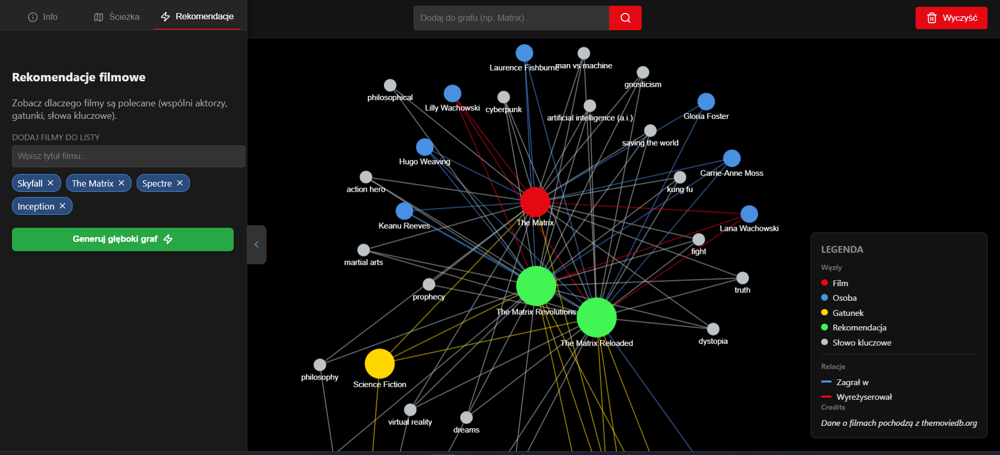

# MovieGraph

## About the Project
MovieGraph is a web application designed to visualize and analyze connections between movies. The main concept of the system relies on utilizing a graph database, which naturally reflects the relationships occurring between movies, actors, and other related entities.

## Features

### Search & Interactive Graph Visualization
The primary entry point to the application is a search bar that supports finding both movies and people, such as actors or directors. As you type, the application dynamically communicates with the API to display suggestions tailored to your query. Upon selecting an object, the app generates a dynamic graph where the chosen entity becomes the central node, surrounded by related nodes including the cast, directors, and genres. Users can fully interact with the graph by moving nodes, zooming in and out, and clicking adjacent nodes to expand the graph further.

### Shortest Path Analysis
This feature allows users to find the shortest connection path between any two nodes, such as actors or movies, in the database. The algorithm searches for the minimum number of steps connecting the two entities and visualizes this specific path on the graph. To ensure precision, the algorithm consciously ignores generic category and keyword nodes, which typically have too many connections.

### Graph-Based Recommendations
The system provides a movie recommendation engine based on the analysis of the graph's structure. Based on a set of titles provided by the user, the algorithm identifies related movies through shared neighbors, such as actors, directors, keywords, or genres. The ranking mechanism uses a weighted scoring system, meaning a shared director generates a higher match score than a shared keyword. Ultimately, the system sums the weights of all edges and visually presents the top recommendations alongside the user's base list on the graph.

## Data Model
The application is primarily based on the Neo4j database. Unlike relational databases, Neo4j uses a graph model consisting of nodes, relationships, and properties.
* **Nodes**: The system defines four main labels: `Movie`, `Person`, `Genre`, and `Keyword`.
* **Relationships**: The edges are directed and include `ACTED_IN`, `DIRECTED`, `HAS_GENRE`, and `HAS_KEYWORD`.

## Architecture & Tech Stack
The system is designed in a classic Client-Server-Database architecture and deployed in the AWS cloud environment.
* **Frontend (Presentation Layer)**: A Single Page Application (SPA) built with React.js.
* **Backend (Logic Layer)**: A Python application server utilizing the FastAPI framework.
* **Database (Data Layer)**: A cloud-based Neo4j graph database (AuraDB).

## Data Source
The data feeding the system is sourced from The Movie Database (TMDB). The data has been properly transformed to match the node and edge structure required by the Neo4j database.
